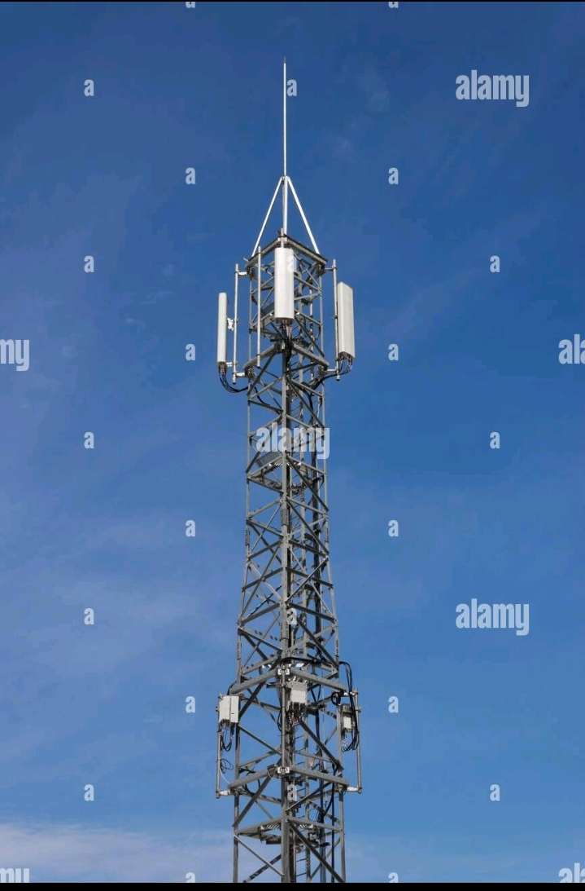

# LIVE
#main{
background-color: seagreen;
font-size: 1.4em;
text-align: center;
}
#footer{
background-color: red;
color: lawngreen;

}

 48 changes: 48 additions & 0 deletions48  
live.html
Original file line number	Diff line number	Diff line change
@@ -0,0 +1,48 @@
<!DOCTYPE html>
<html>
<head>
	<meta charset="utf-8">
	<meta name="viewport" content="width=device-width, initial-scale=1">
	<title></title>
<link rel="stylesheet" type="text/css" href="live.css">
</head>
<body>

<h1><marquee>GO LIVE
 BEYOND COVERAGE</marquee></h1>	

	
<!--Unorder List-->
<ul>
<li>CORPORATE EVENTS</li>
<li>WEDDING AND SOCIAL ENGANGEMENT</li>
<li>AGM,WORKSHOPSAND TRAINING</li>	
<li>RELIGIOUS ACTIVITIES</li>
</ul>
<h2> TEMITOPE OLUWABIYI
         TEAM DIRECTOR
 08097233397</h2>
<!--Unorder List-->
<ul>
<li>PROFESSIONAL VIDEO COVERAGE</li>
<li>REAL-TIME VIDEO STREAMING</li>
<li>PHOTOGRAPHY</li>
<li>LARGE SCREEN</li>
<li>MASS CD/DVD PRODUCTION</li>
<li>ONLINE AND OFFLINE PR SERVICES</li>
<li>WEB ANDMOBILE APP DEVELOPMENT</li>
</ul>

<h3>ADDRESS
 248B IJU WATERWORKS ROAD, ISHAGA,LAGOS.</h3>	
<h1><marquee>WE BROADCAST YOUR EVENTS LIVE TO THE WORLD</marquee></h1>

</body>
</html#head{
background-color: skyblue;
width: 100%;
height: 490px;
align-content: ;
text-align: center;
color: lawngreen;
}
#main{
background-color: seagreen;
font-size: 1.4em;
text-align: center;
}
#footer{
background-color: red;
color: lawngreen;

}

 48 changes: 48 additions & 0 deletions48  
live.html
Original file line number	Diff line number	Diff line change
@@ -0,0 +1,48 @@
<!DOCTYPE html>
<html>
<head>
	<meta charset="utf-8">
	<meta name="viewport" content="width=device-width, initial-scale=1">
	<title></title>
<link rel="stylesheet" type="text/css" href="live.css">
</head>
<body>

<h1><marquee>GO LIVE
 BEYOND COVERAGE</marquee></h1>	

	
<!--Unorder List-->
<ul>
<li>CORPORATE EVENTS</li>
<li>WEDDING AND SOCIAL ENGANGEMENT</li>
<li>AGM,WORKSHOPSAND TRAINING</li>	
<li>RELIGIOUS ACTIVITIES</li>
</ul>
<h2> TEMITOPE OLUWABIYI
         TEAM DIRECTOR
 08097233397</h2>
<!--Unorder List-->
<ul>
<li>PROFESSIONAL VIDEO COVERAGE</li>
<li>REAL-TIME VIDEO STREAMING</li>
<li>PHOTOGRAPHY</li>
<li>LARGE SCREEN</li>
<li>MASS CD/DVD PRODUCTION</li>
<li>ONLINE AND OFFLINE PR SERVICES</li>
<li>WEB ANDMOBILE APP DEVELOPMENT</li>
</ul>

<h3>ADDRESS
 248B IJU WATERWORKS ROAD, ISHAGA,LAGOS.</h3>	
<h1><marquee>WE BROADCAST YOUR EVENTS LIVE TO THE WORLD</marquee></h1>

</body>
</html#head{
background-color: skyblue;
width: 100%;
height: 490px;
align-content: ;
text-align: center;
color: lawngreen;
}
#main{
background-color: seagreen;
font-size: 1.4em;
text-align: center;
}
#footer{
background-color: red;
color: lawngreen;

}

 48 changes: 48 additions & 0 deletions48  
live.html
Original file line number	Diff line number	Diff line change
@@ -0,0 +1,48 @@
<!DOCTYPE html>
<html>
<head>
	<meta charset="utf-8">
	<meta name="viewport" content="width=device-width, initial-scale=1">
	<title></title>
<link rel="stylesheet" type="text/css" href="live.css">
</head>
<body>

<h1><marquee>GO LIVE
 BEYOND COVERAGE</marquee></h1>	

	
<!--Unorder List-->
<ul>
<li>CORPORATE EVENTS</li>
<li>WEDDING AND SOCIAL ENGANGEMENT</li>
<li>AGM,WORKSHOPSAND TRAINING</li>	
<li>RELIGIOUS ACTIVITIES</li>
</ul>
<h2> TEMITOPE OLUWABIYI
         TEAM DIRECTOR
 08097233397</h2>
<!--Unorder List-->
<ul>
<li>PROFESSIONAL VIDEO COVERAGE</li>
<li>REAL-TIME VIDEO STREAMING</li>
<li>PHOTOGRAPHY</li>
<li>LARGE SCREEN</li>
<li>MASS CD/DVD PRODUCTION</li>
<li>ONLINE AND OFFLINE PR SERVICES</li>
<li>WEB ANDMOBILE APP DEVELOPMENT</li>
</ul>

<h3>ADDRESS
 248B IJU WATERWORKS ROAD, ISHAGA,LAGOS.</h3>	
<h1><marquee>WE BROADCAST YOUR EVENTS LIVE TO THE WORLD</marquee></h1>

</body>
</html

